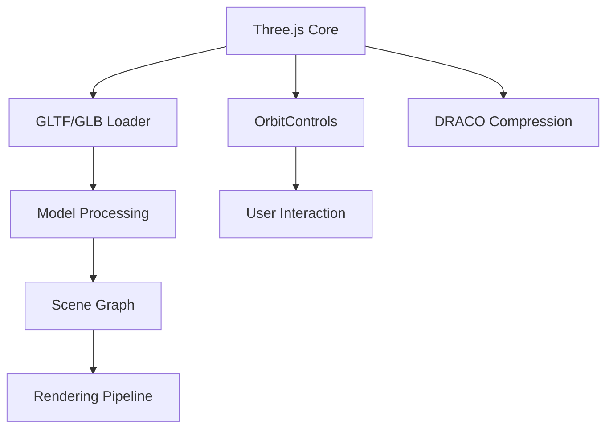

# 🌌 OrbitView - The Ultimate 3D Model Viewer 

**✨ A Sketchfab-inspired, open-source 3D viewer built with Three.js that brings your models to life!**

---

## 🚀 Features That Will Blow Your Mind

| Feature | GIF Demo | Description |
|---------|----------|-------------|
| **🎨 Real-time Lighting** |  | Dynamic lighting presets (Studio, Outdoor, Night) with adjustable intensity |
| **🔍 Model Inspection** |  | Wireframe mode, statistics panel, and full measurement tools |
| **🌐 Environment Control** |  | Customizable environment colors and HDRI backgrounds |
| **⚡ Performance Modes** |  | Switch between High Quality and Performance modes |

---

## 🛠️ Technical Deep Dive

### 🧩 Core Architecture

### 🔥 Advanced Features
1. **Dynamic Lighting System**
   - 3-point lighting setup (Key, Fill, Back)
   - Physically-based rendering (PBR) materials
   - Real-time shadow mapping (4096x4096 resolution)

2. **Smart Model Handling**
   - Auto-centering and scaling
   - Geometry statistics (triangles, vertices)
   - Texture analysis and optimization

3. **Environment Controls**
   - Custom HDRI environment maps
   - Color-picker for background
   - Reflection intensity controls

---

## 🏗️ Built With

---

## 🚧 Future Roadmap

### 🔜 Coming Soon
- [ ] **AR/VR Mode** - View models in augmented/virtual reality
- [ ] **Collaborative Viewing** - Multi-user model inspection
- [ ] **Animation Timeline** - Control model animations

### 🌐 Framework Ports
| Framework | Status | Demo |
|-----------|--------|------|
| React Three Fiber | ✅ Completed | [Demo](link) |
| Vue Three | 🚧 In Progress | - |
| Svelte Cubed | ⏳ Planned | - |
| Angular + Three | ⏳ Planned | - |

---

## 🎮 Try It Live!

---

## 🤝 Contribute
We 💖 contributors! Check out our [Contribution Guidelines](CONTRIBUTING.md) to get started.

---

## 📜 License
MIT © 2023 [Your Name]

---

> "The best way to predict the future is to invent it." - Alan Kay

Let's reinvent 3D visualization together! 🚀
